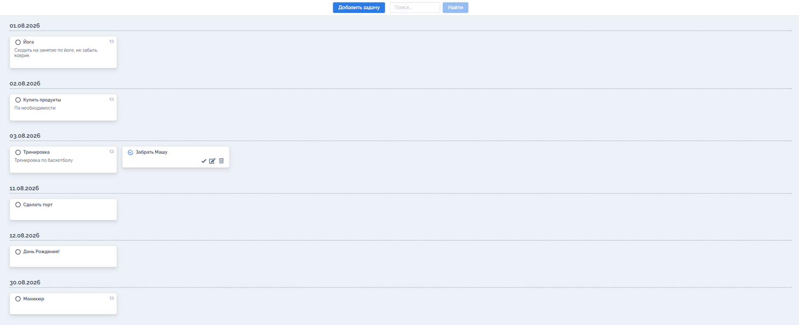

# Go Task Scheduler

A task management web application built with Go.

The application allows users to create, edit, complete and delete tasks, configure recurring schedules, and search tasks by text or date. Data is stored locally in SQLite.

## Preview




## Features

- Create, edit and delete tasks
- Mark tasks as completed
- Search tasks by title, comment or date
- Configure recurring tasks:
  - yearly;
  - every specified number of days;
  - on selected weekdays;
  - on selected days of the month
- Store data in SQLite
- Configure the application through environment variables
- Optional password authentication using JWT
- Run the application locally or in Docker
- Automated build and test checks with GitHub Actions

## Tech Stack

- Go 1.25
- `net/http`
- SQLite
- JWT
- HTML, CSS and JavaScript
- Docker
- GitHub Actions

## Project Structure

```text
.
├── .github/workflows   # CI configuration
├── pkg
│   ├── api             # HTTP handlers and authentication
│   └── db              # SQLite initialization and queries
├── tests               # Application tests
├── web                 # Frontend files
├── Dockerfile
├── go.mod
└── main.go
```

## Running Locally

### Requirements

- Go 1.25 or newer
- Git

### Installation

Clone the repository:

```bash
git clone https://github.com/go-by-oksy/go-task-scheduler.git
cd go-task-scheduler
```

Download dependencies:

```bash
go mod download
```

Run the application:

```bash
go run .
```

Open the application in a browser:

```text
http://localhost:7540
```

By default, the application:

- runs on port `7540`;
- creates `scheduler.db` in the project directory;
- runs without authentication.

## Configuration

The application supports the following environment variables:

| Variable | Description | Default |
|---|---|---|
| `TODO_PORT` | HTTP server port | `7540` |
| `TODO_DBFILE` | Path to the SQLite database | `scheduler.db` |
| `TODO_PASSWORD` | Password that enables authentication | empty |

### PowerShell example

```powershell
$env:TODO_PORT="7540"
$env:TODO_DBFILE="scheduler.db"
$env:TODO_PASSWORD="change-me"

go run .
```

### Linux and macOS example

```bash
TODO_PORT=7540 \
TODO_DBFILE=scheduler.db \
TODO_PASSWORD=change-me \
go run .
```

When `TODO_PASSWORD` is set, open:

```text
http://localhost:7540/login.html
```

## Running with Docker

Build the image:

```bash
docker build -t go-task-scheduler .
```

Run the container:

```bash
docker run --rm \
  -p 7540:7540 \
  -v "${PWD}:/data" \
  -e TODO_PASSWORD=change-me \
  go-task-scheduler
```

The SQLite database will be stored in the mounted `/data` directory.

Open:

```text
http://localhost:7540
```

## Testing

First, start the application:

```bash
go run .
```

In another terminal, run the application test:

```bash
go test -run "^TestApp$" ./tests
```

The GitHub Actions workflow automatically downloads dependencies, builds the application, starts the server and runs the application test on every push and pull request.

## Author

Developed by [Oksana](https://github.com/go-by-oksy).